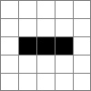
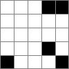
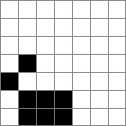

# GameOfLife

`GameOfLife` is a `numpy` based generalized implementation of [Convey's Game of Life](https://en.wikipedia.org/wiki/Conway%27s_Game_of_Life).

## Install

Installation works by:
```bash
git clone git@github.com:lionjo/Game-of-Life.git
cd Game-of-Life
```
Then install using pip:
```bash
pip install -e .
```
A Main window can be opened by running the `main.py` script in `Applications`.
Or by just typing `OurGameOfLife.py` in your terminal (this uses the script in `scripts/`).
Also look through the other files in `Applications`!
## The "world"

The world is a 2D map of two possible states, `alive`, represented by `1` or `white`, and `dead`, represented by `0` or `black`.

In the main window the user can "kill" or "give birth" to certain cells by just clicking on them. Living cells then turn dead, and dead cells turn alive.

Now, we can assing a "rule" to the world, which determines which cells should live in the next step and which should be dead.
For example, one could impose the following four rules:
 - Cells that have exactly 3 alive direct neighbours (diagonal neighbours count), would stay alive or would be born if dead.
 - Cells with exactly two alive neighbours would survive if they were alive before but 2 neighbours is not enough for a dead cell to come alive
 - Cells with only one alive member would die or would stay dead du to loneliness.
 - Cells with 4 or more neighbours would die or stay dead due to overpopulation

This is the standard rule of Conveys Game of life and this simple set of rules leads to surprisingly complex structures.
## Generalized Rules

In general, there are $2^{2n}$ possible rules for a game of life, where $n$ is the number of possible alive neighbouring states.
If one takes all adjecent cells as neighbours, direct and diagonal, then $n=9$ (as a cell could have between 0 and 8 alive neighbours).
So convey's game of life is just one of 262144 possible rules for a diagonal neighbourhood.

The rule can be written as a 2D array, e.g.

|   |  0 | 1 |2|3|4|5|6|7|8|
|---|---|--|-|-|-|-|-|-|-|
| if dead:  | dead  |dead|dead|alive|dead|dead|dead|dead|dead|
| if alive:  |  dead |dead|alive|alive|dead|dead|dead|dead|dead|

The numbers stand for the number of neighbours.
The rule is Convey's game of life.
We can also write the above table as an array:
```python
rule = [[0, 0, 0, 1, 0, 0, 0, 0, 0],
        [0, 0, 1, 1, 0, 0, 0, 0, 0]]
```

Every of such rules can also be written more compactly, by associating every rule with a number.
Just write every rule as a binary number, by flattening it out (and apply some flipping):
e.g. the rule we defined earlier can be written as `000000000011100000`.
This is a binary number and can be transferred to `224` -- the unique identifier for Conveys game of life (imposing the 8 field neighbourhood).


## The algorithm

Oftentimes numerical implementations of the game of life are done unnecessarily complex or numerically inefficient.
Python, as a interpreted language also has drawbacks in naive implementations of parallel operations.
Luckily there is `numpy` and we can make use of the concept of `vectorization`: A very fast implementation of parallel operations within numpy.
The game of life grid can be written as a number of such parallel operations.
The grid can be written as a matrix of 1's and 0's.
To determine the number of neighbours we can just shift the array by one index in every dimension and add it up!
Luckily, `numpy` has a function to achieve this very efficiently:
```python
no_neighbours = (
            np.roll(array, 1, axis=0)
            + np.roll(array, -1, axis=0)
            + np.roll(array, 1, axis=1)
            + np.roll(array, -1, axis=1)
            + np.roll(np.roll(array, 1, axis=1), 1, axis=0)
            + np.roll(np.roll(array, -1, axis=1), 1, axis=0)
            + np.roll(np.roll(array, 1, axis=1), -1, axis=0)
            + np.roll(np.roll(array, -1, axis=1), -1, axis=0)
        )
```
This gives us the number of neighbours as entries in the location of the respective cell.
Next, we can write the rule in a specific form, discussed in the previous section.
```python
rule = np.array([[0, 0, 0, 1, 0, 0, 0, 0, 0], [0, 0, 1, 1, 0, 0, 0, 0, 0]])
```
And now we can use these two arrays to determine the next array:
```python
next_array = rule[array,no_neighbours]
```
Why does this work?
We specified the rule such that the first vector, `[0, 0, 0, 1, 0, 0, 0, 0, 0]` applies for dead cells, the second, `[0, 0, 1, 1, 0, 0, 0, 0, 0]`, for alive cells.
`array` consists of `0`s and `1`s, hence we can use the entries of `array` as indices for `rule` and it automatically applies to the correct rule: dead cells use the first vector, alive cells the second one.
Next, we constructed our vector `no_neighbours`, such that the number of neighbours are written as entries.
And, you guessed it already, we can use these entries as indices in `rule`.
When accessing an array, here `rule`, by two matrices, `array` and `no_neighbours`  which have the same dimensions, say $n\times m$, then `rule[array,no_neighbours]` also has dimensions $n \times m$ and consists of entries in `rule`.

These three lines of code are enough to implement a general version of conveys game of life for arbitrary rules.
The rest of the package is GUI.

## Examples

For the 'usual' set of rules, rule 224, aka Convey's Game of Life, there are many known stable figures, e.g. blinkers (left) and gliders (right):

 

But did you know that there are similar figures for other rules too? Here is an example glider in rule 736:



Considering that there are $2^{18}$ different possible rules in [Moores' neighbourhood](https://en.wikipedia.org/wiki/Moore_neighborhood), and $2^{49}$ different initial conditions in a $7\times7$ cell window (just as an example), makes finding interesting patterns a very difficult and interesting challenge.
A brute force algorithm would need to investigate $1.47\cdot  10^{20}$ different situations!

## Timing

The pure computational part of the package can be called like this. Note the `check_periodicity=False`.
```python
grid = Grid(ruleDEC=225)
grid.randomize()
grid.multiple_steps(no_steps,check_periodicity=False)
```

For a single CPU, these are the run-times in wall clock time:

| # steps (100x100 Size) | time [s] |
|--|--|
| 1000| 0.25|
| 5000| 1.25|
| 10000| 5.47|

| # Gridsize (3000 steps) | time [s] |
|--|--|
| 100x100| 0.91|
| 300x300| 6.51|
| 500x500| 25.9|

These times are about 2 times slower than `Mathematicas` Cellular Automata implementations:
```
CellularAutomaton["GameOfLife", RandomInteger[1, {500, 500}], {{{3000}}}]
```
Which takes 13 s to evaluate on (the same) 1.8 GHz CPU.

Enabling periodicity checks, `check_periodicity=True`, which is required to find periodic patterns, slows the times down.

### Thank you!

Thank you for reading this far!
If you like the package and find it useful please consider starring :star: the project.
If not, let me know what you are missing, via an issue or via DM.
